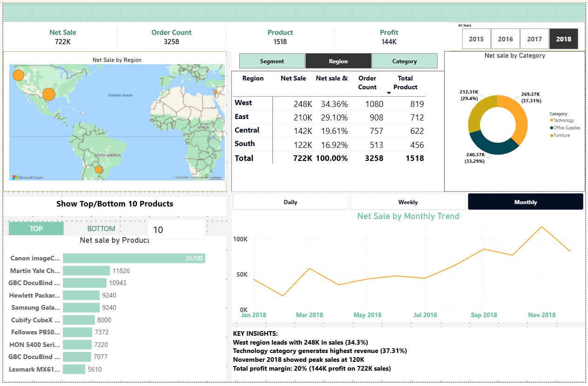

**Power BI Portfolio - Deepak**

Welcome! I'm Deepak, a Project Manager with 1+ years of experience in data analysis and reporting. This portfolio showcases my Power BI dashboard projects.

**About Me**

Location: Bangalore, India
Current Role: Project Manager at CultSport Pvt Ltd.
Skills: Power BI, Excel, DAX, Data Visualisation, MIS Reporting
Email: your.email@gmail.com

**Project 1: Sales Performance Dashboard**

Objective
Analyse sales performance across regions, products, and time periods to identify growth opportunities.

Key Features
Total sales tracking with KPIs (₹7.22L sales, ₹1.44L profit)
Geographic analysis with an interactive map
Product performance analysis (top 10 products)
Monthly trend analysis
Category-wise revenue breakdown

Key Insights
The West region leads with 34.3% of total sales
The technology category generates the highest revenue (37.31%)
November 2018 showed peak sales at ₹120K
20% profit margin maintained across all regions

Tools Used
Power BI Desktop
DAX for custom calculations
Azure Maps for geographic visualisation

**Project 2: HR Attrition Analytics Dashboard**

Objective
Analyse employee attrition patterns to help HR reduce turnover and improve retention strategies.

Key Features
Attrition tracking with 16.1% rate
Department-wise attrition analysis
Age group and gender distribution
Salary correlation with attrition
Job satisfaction analysis
Interactive filters for deep-dive analysis

Key Insights
16.1% attrition rate (above industry average of 10-15%)
The R&D department has the highest attrition (133 employees)
26-35 age group accounts for 49% of attrition
69% of attrition in employees earning <₹5K/month
Laboratory Technicians have the highest role-specific turnover

Recommendations
Review R&D compensation packages
Implement retention programs for the 26-35 age group
Conduct a salary benchmarking study
Improve the Lab Technician's working conditions

Tools Used
Power BI Desktop
DAX for KPI calculations
Advanced filtering and slicers

**Skills Demonstrated**

Technical Skills
Power BI Desktop (Dashboard creation)
DAX (Data Analysis Expressions)
Data Modeling
Data Visualisation Best Practices
Interactive Filtering
KPI Development

Business Skills
Sales Analysis
HR Analytics
Business Intelligence
Data-Driven Decision Making
Insight Generation
Stakeholder Communication

**Contact Me**

I'm currently open to opportunities in:
Data Analyst roles
Business Intelligence positions
MIS Analyst positions
Power BI Developer roles

Email:deepak.rao984@gmail.com  
LinkedIn:
Location: Bangalore, India

**Currently Learning**

Advanced DAX functions
SQL for data querying

**Last Updated: January 2026**

       └── hr-dashboard-detail.png
